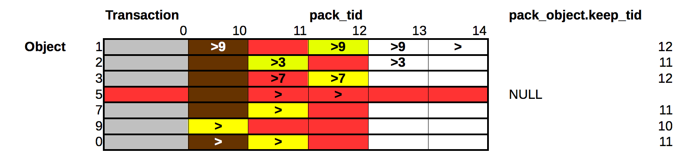

========================
 What Happens In A Pack
========================

Let us begin by examining this diagram of a database being packed.

In this model, a row represents an object (with an unchanging OID but
a changing state) and a column represents a transaction (aka
revision).

Legend:

>
  Modified in transaction, refers to no other objects
>n
  Modified in transaction, has a reference to object *n*
Red
  Will be packed
Yellow
  History will terminate (not go back farther than) this revision
Brown
  Packed previously
White
  Not packed
Grey
  Pseudo-transaction

Interpretation
==============

What does this mean for each object?

1
  Revisions 14, 13 and 12 are kept, while revision 10 is dropped.
  The ``prev_tid`` of revision 12 is set to 0. Until the current revision,
  this object referred to object 9.
2
  Both revisions (13 and 11) are kept. This object is keeping object
  3 alive. Although nothing refers to this object, packing does not
  remove objects with revisions beyond ``pack_tid``.
3
  Since a current revision of object 2 refers to this object,
  revision 12 is kept, but its history is cut short (revision 11 is
  dropped and the ``prev_tid`` for revision 12 is set to 0).
5
  Nothing refers to this object, so the OID is completely removed from
  the database.
7
  Since a current revision of object 3 refers to this object, revision
  11 is kept.
9
  Revision 13 of object 1, which refers to this object, will not be
  packed, so this OID must be kept even though no current revision
  refers to it. This object is keeping alive transaction 10, which was
  packed earlier.
0
  This is the root object since its OID is 0. The root object is
  never removed from the database, but its history will be cut short:
  revision 10 will be removed and the ``prev_tid`` of revision 11 will be
  set to 0.

Notes
=====

* Packing removes both columns and rows from the table, with exceptions.

* We always pack a list of transactions ranging from just after ``tid`` 0
  (which is a pseudo-transaction) to ``pack_tid``, which is the last
  transaction committed before an application-specified time.

* The list of columns to remove is 0 < ``tid`` <= ``pack_tid``.

* The list of rows to remove is in the temporary table
  ``pack_object``, where ``keep_tid`` is ``NULL``.

* The list of rows to cut short (i.e. leave only the current state and
  otherwise pack) is also in the temporary table ``pack_object``, where
  ``keep_tid`` is not ``null``.

* The ``keep_tid`` value of the pack_object table, when set, is copied
  from ``current_object``.

* Some of the transactions may have been packed already. Previously
  packed transactions hang around until they contain no object states.

* Packing does not change ``current_object`` except when it removes
  objects from the database.

* After packing, some of the packed transactions may be kept because
  object states need them, but they will not appear in the list of
  undoable transactions because the packed bit is set.

* In the model above, all of the transactions are kept (with the
  packed bit set), but many object states are removed. If there were a
  purely red or purely brown column, it would be removed completely.
