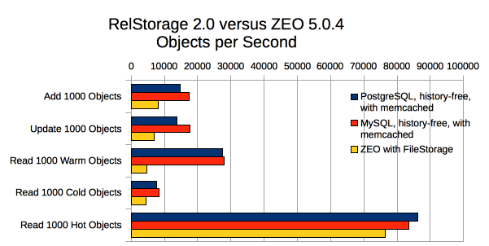
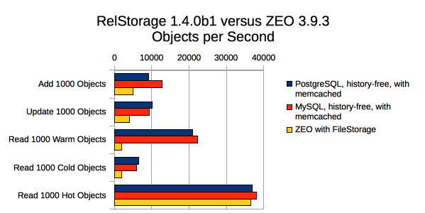

=============
 Performance
=============

.. toctree::

   cache-tracing

Comparisons
===========

This document captures various performance metrics, comparing
RelStorage to other ZODB storages at given points in time. The numbers
given here cannot be compared to each other outside their own test.

RelStorage 3
------------

RelStorage 3 performance is substantially improved on many benchmarks.
See `this post
<https://dev.nextthought.com/blog/2019/11/relstorage-30.html#performance-improvements>`_
for details.

RelStorage 2.1a1 vs RelStorage 2.0
----------------------------------

This section compares the performance improvements in RelStorage 2.1a1
with RelStorage 2.0. (Hot and warm results are omitted because they
had essentially no change in these tests.)

All RelStorage schemas were history free and did not use memcache.
ZODB was version 5.1.1, MySQL was version 5.7.17, and PostgreSQL was
version 9.6.1. All databases and cache settings were at the default.
The database drivers were mysqlclient-1.3.9 and psycopg2-2.6.2.

The test suite was zodbshootout 0.6 running on CPython 2.7.13 on a 2.5Ghz
Intel Core i7 (MacBookPro11,5) under macOS 10.12.2.

First, the default test scenario for zodbshootout (1000 objects per
transaction, each with a size of 128), running in two concurrent
processes. We can see substantial gains for PostgreSQL on all tests (30-40%),
while MySQL shows modest gains for adding and reading objects (10%).

.. zodbshootout -c2

.. image:: perf-rs21v20-c2.png

That test is useful for assessing raw throughput, but it is not very
representative of most real-world uses. Studies of some production
databases show that most transactions consist of 100 or fewer objects
that are often around 256 bytes in size. (Naturally these numbers can
vary quite a bit depending on application.) Also, many applications
use in-process concurrency, whether threads or gevent.

This test reflects that, using 6 threads each working on 100 256-byte
objects. We can again see substantial gains for PostgreSQL on adding
and updating objects (20% and 60%, respectively), and modest gains for
MySQL on both those tasks (10% and 7%, respectively).

.. zodbshootout -c6 --threads -n 100 --test-reps 200 -s 256

.. image:: perf-rs21v20-c6-n100-s256.png

RelStorage 2.0
--------------

All RelStorage schemas were history free and did not use a memcache instance.
ZEO was version 5.0.4 and used a FileStorage backend from ZODB 5.1.1
MySQL was version 5.5.53 and PostgreSQL was version 9.6.1. The
database drivers were mysqlclient-1.3.9 and psycopg2 2.6.2. All
RelStorage cache settings were at their default values (MySQL
configuration had been somewhat modified from its defaults but
PostgreSQL was at its defaults).

The test suite was zodbshootout 0.6 with a concurrency level of 2 (and
all other options the default), running on CPython 2.7.12 on a 2.5Ghz
Intel Core i7 (MacBookPro11,5) under macOS 10.12.2.

.. objects_per_txn=1000, object_size=128, mappingtype=<class
   'persistent.mapping.PersistentMapping'> and concurrency=2 (threads?
   False)

.. NOTE: mysql55 had previously had some perf tuning done to it, while
   postgresql was using default out-of-box settings. So these numbers
   aren't entirely fair. Here's the contetns of my.cnf:

   [mysqld]
   max_connections = 500
   max_allowed_packet = 4M
   slave_max_allowed_packet = 1073741824
   #net_buffer_length = 32K
   net_buffer_length = 20M
   max_allowed_packet = 18M
   innodb_data_file_path = ibdata1:10M:autoextend
   innodb_buffer_pool_size=256M
   innodb_additional_mem_pool_size=20M
   innodb_log_file_size=64M
   innodb_log_buffer_size=8M
   innodb_flush_log_at_trx_commit=1
   innodb_file_per_table
   skip-networking = false

======================  ==========  =====  =====
Transaction             PostgreSQL  MySQL	ZEO
======================  ==========  =====  =====
Add 1000 Objects        19534       23184   8152
Update 1000 Objects     17140       23790   7122
Read 1000 Warm Objects  14232       16649   4796
Read 1000 Cold Objects  15595       18070   4860
Read 1000 Hot Objects   86326       88422  82600
======================  ==========  =====  =====

.. image:: perf-rs20-no-mem.png

Memcache
~~~~~~~~

This is exactly the same configuration as above, but shows the effect
of introducing a local memcache instance. The "warm" test performs
better, but the other tests perform worse.

======================  ==========  =====  =====
Transaction             PostgreSQL  MySQL	ZEO
======================  ==========  =====  =====
Add 1000 Objects          14789     17378   8220
Update 1000 Objects       13834     17711   7021
Read 1000 Warm Objects    27394     27978   4662
Read 1000 Cold Objects     7621      8415   4344
Read 1000 Hot Objects     86165     83438  76540
======================  ==========  =====  =====

PyPy
~~~~

This is the same as the second configuration, except we're using PyPy
5.6.0 for everything (including running the ZEO server). The database
drivers were PyMySQL-0.7.9  and psycopg2cffi-2.7.5.

======================  ========== ======  =====
Transaction             PostgreSQL  MySQL   ZEO
======================  ========== ======  =====
Add 1000 Objects            15235  13849   4681
Update 1000 Objects         18522  25939   4853
Read 1000 Warm Object       15138  964041  23843
Read 1000 Cold Object       11974   9876   3360
Read 1000 Hot Objects       99241  81685   25552
======================  ========== ======  =====

.. image:: perf-rs20pypy.png

Under PyPy, the benchmark was run in shared threads mode (``--threads
shared``) instead of separate processes, to allow PyPy's JIT to warm
up. Under CPython, shared threads for concurrency two generally
*reduces* performance (with the exception of one test), but under PyPy
it substantially improves performance.

For comparison, here's the shared thread results for CPython:

======================  ========== ======  =====
Transaction             PostgreSQL  MySQL   ZEO
======================  ========== ======  =====
Add 1000 Objects             13409  14081  4852
Update 1000 Objects          11541  14310  4496
Read 1000 Warm Objects       42646  43699  123079
Read 1000 Cold Objects       10253   7712  3497
Read 1000 Hot Objects        24973  26129  25049
======================  ========== ======  =====

RelStorage 1.6.1 vs RelStorage 2.0
~~~~~~~~~~~~~~~~~~~~~~~~~~~~~~~~~~

These tests are run using the same configuration (databases, database
drivers, CPython version and same machine) as above, to show any
performance differences between RelStorage 2.0 and RelStorage 1.6.1
(running with ZODB 4.4.4 and ZEO 4.3.1).

.. image:: perf-rs20-rs16.png

RelStorage 1.4.0b1
------------------

All RelStorage schemas were history free and used a memcache instance.
ZEO was version 3.9.3 and used a FileStorage backend.

The test suite was zodbshootout 0.2 with a concurrency level of 2,
running on Python 2.6 on a 2.1Ghz Intel Core 2 Duo (T8100)

======================  ==========  =====  =====
Transaction             PostgreSQL  MySQL	ZEO
======================  ==========  =====  =====
Add 1000 Objects        9177        12711   5044
Update 1000 Objects     10040        9431   4017
Read 1000 Warm Objects  20897       22310   1924
Read 1000 Cold Objects  6591         5853   1932
Read 1000 Hot Objects   36847       37950  36545
======================  ==========  =====  =====

